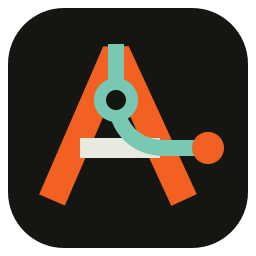
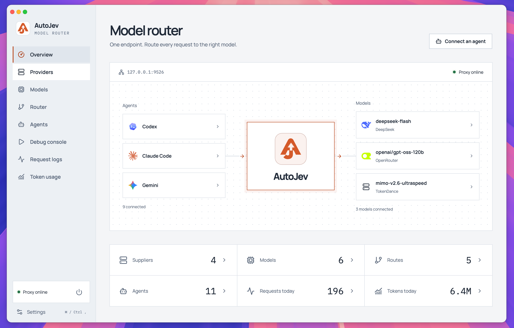

<p align="center">
  
</p>
<h1 align="center">AutoJev</h1>
<p align="center"><a href="README.md">English</a> · 简体中文</p>
<p align="center">为本地 AI 智能体提供统一网关与模型路由。</p>
<p align="center">
  <a href="https://github.com/thinkany-ai/autojev/releases">下载</a> ·
  <a href="https://autojev.ai">网站</a> ·
  <a href="https://github.com/thinkany-ai/autojev/issues">反馈</a> ·
  <a href="LICENSE">AGPL-3.0-only</a>
</p>

AutoJev 是基于 Tauri、React 和 Rust 的桌面应用。集中管理服务商、模型和路由，让 Codex、Claude Code、Hermes 等智能体通过同一个本地地址调用模型。

> 项目处于早期开发阶段。安装包以 GitHub Releases 实际发布的平台与版本为准。



## 功能

- **服务商与模型管理**：保存接口地址、API 密钥、费用、图片输入和上下文长度等信息。图片与上下文配置仅作说明，不限制模型调用。
- **模型路由**：支持智能选择和负载均衡，可按速度、费用、质量或均衡策略选择候选模型；支持会话粘性、故障转移与冷却。
- **决策模型**：可使用 OpenRouter Jev 选择候选模型；不可用时按本地路由逻辑回退。
- **协议转换**：支持 OpenAI Responses、Chat Completions 和 Anthropic Messages，以及流式响应和函数工具调用。具体限制见[协议兼容性说明](docs/protocol-conversion.md)。
- **智能体接入**：检测本地智能体、保存模型与路由选择、备份和恢复配置，并在启动时重新连接之前接入的智能体。不同客户端的模型目录能力不同。
- **调试与统计**：内置调试台、模型测速、请求日志、Token 用量和费用估算。
- **桌面更新**：正式版支持自动检查更新、手动下载与安装、签名校验和重启更新。

```text
Codex / Claude Code / Hermes / 其他兼容客户端
                       │
           http://127.0.0.1:9527/v1
                       │
                AutoJev 本地网关
                       │
            智能选择 / 负载均衡 / 故障转移
                       │
          OpenRouter / DeepSeek / 自定义服务商
```

## 快速开始

1. 从 [Releases](https://github.com/thinkany-ai/autojev/releases) 下载适合系统的安装包。
2. 在「服务商」中填写接口地址和 API 密钥。
3. 添加模型，选择上游 API 类型，并填写模型 ID 和费用。
4. 在「路由」中设置候选模型与调度策略；使用智能选择时，可在「设置 → 网关与路由 → 决策模型」配置 Jev。
5. 在「智能体」中选择模型或路由并连接，也可以手动配置客户端。
6. 在「调试台」验证调用，通过请求日志查看最终使用的服务商和模型。

正式版默认监听 `127.0.0.1:9527`，开发版使用 `127.0.0.1:9526`。路由的模型 ID 为 `autojev/<路由 ID>`。

| 接口 | 路径 |
| --- | --- |
| OpenAI Responses | `POST /v1/responses` |
| OpenAI Chat Completions | `POST /v1/chat/completions` |
| Anthropic Messages | `POST /v1/messages` |

模型的 API 类型应与上游服务匹配。协议转换不能为模型增加识图、推理或工具调用能力，部分客户端专有功能无法转换。

### 自定义智能体

添加本地可执行文件后，只需填写可选的「配置文件路径」。留空使用识别到的智能体默认路径。目前自动识别 Kilo、OpenCode、OpenClaw、Hermes、Grok 和 Kimi；未知客户端保留手动配置，不会按文件扩展名猜测写入字段。

保存后，在智能体列表选择模型或路由并连接；当前写入第一个已选项作为默认值，不生成多模型目录。断开、停止网关或退出时恢复原配置，保留无冲突的后续修改。已添加的自定义条目可通过配置按钮编辑；连接中需先断开。命令测试使用智能体当前配置，不会提前注入。

Kilo 默认配置位置与结构参考[官方 CLI 文档](https://kilo.ai/docs/code-with-ai/platforms/cli)和[自定义模型文档](https://kilo.ai/docs/code-with-ai/agents/custom-models)。

### 网关生命周期

- 关闭窗口后，应用继续在后台运行。
- **暂停服务**保留智能体配置，拒绝新请求；已开始的请求继续完成。当前暂停响应为 HTTP 404，错误码为 `gateway_paused`。客户端可能仍会自行重试。
- **停止并恢复配置**先恢复接入前的智能体配置，再关闭网关。
- 从托盘退出也会执行配置恢复。下次启动会按已保存的连接设置重新接入；主动断开的智能体不会自动重连。

## 本地开发

需要 Node.js 22+、pnpm 10+、Rust stable，以及对应平台的 [Tauri 开发依赖](https://v2.tauri.app/start/prerequisites/)。

```bash
git clone https://github.com/thinkany-ai/autojev.git
cd autojev
pnpm install --frozen-lockfile
pnpm dev
```

开发版使用独立应用标识和数据库，不检查正式版更新。只预览界面可运行 `pnpm dev:web`；浏览器预览不能执行桌面专属操作。

```bash
pnpm test
pnpm build
cargo test --locked --manifest-path src-tauri/Cargo.toml --lib
pnpm release:check
```

## 数据与隐私

- 配置与服务商密钥保存在本地数据库 `~/.autojev/autojev.db`；开发版使用 `autojev-dev.db`。**密钥当前未加密存储**。
- 请求日志保存模型、状态、耗时、用量和估算费用，不持久化完整提示词、回复或 API 密钥。
- 模型请求会发送至所选上游服务；Jev 决策使用路由特征和候选模型元数据。
- 连接智能体会修改其配置并创建备份。不要将真实配置、数据库、密钥或备份提交到仓库。
- 网关默认仅监听本机。费用与用量取决于服务商返回的数据，页面金额是估算值。

## 打包与更新

macOS 本地签名打包：

```bash
pnpm release:mac --check  # 检查本地发布条件
pnpm release:mac         # 构建、签名、公证
```

发布工作流面向 macOS Apple Silicon / Intel、Windows x64 和 Linux x64，生成安装包与签名更新包。版本标签触发草稿构建，全部平台及更新清单验证成功后才发布。

正式版启动后及每四小时自动检查更新，可在「设置 → 通用」关闭；手动检查与安装入口在「设置 → 关于」。安装前请结束正在进行的智能体请求。

签名资料、GitHub Secrets、首次发布和更新验证步骤见[发布指南](docs/releases.md)。

## 项目结构

```text
src/                 React 界面、桌面命令桥接与更新控制器
src-tauri/src/       Rust 网关、路由、协议转换、智能体与本地存储
scripts/            开发、图标和发布脚本
.github/workflows/   持续集成与多平台发布
docs/              协议说明和发布文档
```

## 贡献与开源协议

欢迎提交 Issue 和 PR。参与开发请阅读 [CONTRIBUTING.md](CONTRIBUTING.md)，安全问题请按 [SECURITY.md](SECURITY.md) 私下报告。

AutoJev 源代码使用 **[AGPL-3.0-only](LICENSE)**，© 2026 ThinkAny, LLC。修改后的版本通过网络提供服务时，须按协议向交互用户提供对应源码。需要不受 AGPL copyleft 义务约束的商业授权，请联系 [support@thinkany.ai](mailto:support@thinkany.ai)。

第三方图标及其他资源保留各自许可，见 [NOTICE](NOTICE) 和资源目录中的许可证。AutoJev 名称与标志的使用见 [TRADEMARKS.md](TRADEMARKS.md)。
