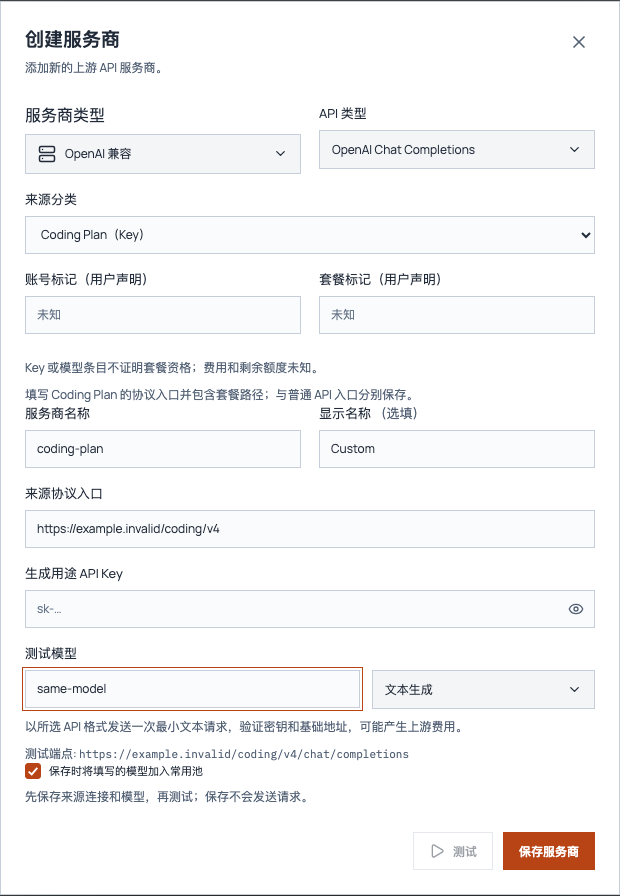

# R2：显式 API 来源的隔离验收

依据：[当前规格 #51](https://github.com/LC-86/JevModelRouter/issues/51) 与 [R2 / #53](https://github.com/LC-86/JevModelRouter/issues/53)。本票复用既有 API 派发、三协议转换和固定模型 UUID 网关；订阅认证与 CPA 连接由 R3 接续。

## 实际支持范围

来源表单区分官方 API、第三方 API、使用 Key 的 Coding Plan。OpenRouter 与 ZenMux 是生成来源选项；不需要配置 Choice 或决策密钥。ZenMux 和 Coding Plan 的 endpoint 由用户明确填写，不猜测品牌、套餐或版本路径。



截图为本地网页预览，未输入密钥；原生 IPC 与实际请求证据来自下述独立桌面验收。

| 接口 | 本票证据 | 限制 |
| --- | --- | --- |
| 官方、OpenRouter、ZenMux、Coding Plan 的 Chat 兼容生成 | 原生 React 表单 → IPC 保存 → 新进程重开 → 固定 UUID 网关 → 各自回环接收器 | 虚构 Key；没有验证任一真实 provider 的权益、额度或生产可用性 |
| Chat、Responses、Messages 客户端文本与 SSE | 原生验收的三种下游协议均命中固定 Chat 兼容来源并保留终态 | 复用既有转换；不增加该来源未声明的上游协议能力 |
| 显式 Responses / Messages 上游 | 表单可声明，派发复用现有协议实现；虚构三协议上游与各三协议下游的分段 SSE 脱敏回环矩阵通过 | 本票逐来源桌面验收只验证 Chat 上游；真实接口仍待 R7 |
| 使用 Key 的 Coding Plan | 独立连接及显式套餐协议基址，例如回环 `/coding/v4` | 不提供全 OAuth；非兼容私有协议、自动套餐识别、权益和额度查询未支持 |

默认价格字段的 `*_price_known` 保持 false，界面显示未知；数值占位不构成零费用证据。Key、用户声明的账号/套餐标签以及模型条目都不证明套餐资格。

Chat 同协议沿用既有 `n>1` 透传，文本、拒绝、推理及工具参数按上游 choice index 隔离；跨协议转换仍明确拒绝多 choice，不扩大转换能力。非 JSON SSE 扩展事件保留全部逻辑 data 行（包括空行）、事件元数据与终态。

## 共享数据与调用边界

`AppConfig.api_sources` / `DashboardSnapshot.api_sources` 是按 Provider ID 索引的非秘密元数据：连接实例 UUID、世代、分类、显式协议基址、上游协议、后端生成的 `api-generation:<connection_instance_uuid>` 凭据引用，以及账号/套餐的 unknown 或 user_declared 状态。Provider/Model 既有字段和模型 UUID 保持兼容；没有迁移进订阅连接。

每个新来源连接只绑定一种生成用途。保存后，来源 ID、分类、账号/套餐标签、endpoint、协议和凭据不允许原地替换；更换这些信息或补缺凭据时创建新连接及新模型 UUID。名称、测试模型、选择和停用仍可编辑。模型 UUID 不能原地改绑另一来源或裸模型；模型协议必须继承或匹配来源协议，不匹配的新增和编辑在保存前拒绝。

新建显式来源必须提供非空生成 Key；缺失或全空白 Key 在保存提供商、来源、凭据引用和模型前拒绝。表单显示“保存此来源前，请输入生成用途 API Key”；修正后可继续使用同一个未保存 ID。已有连接不提供新 Key 的正常编辑保留原凭据；旧未分类 API 的可选 Key 保存语义保持。

账号/套餐标签的 160 长度限制与既有 HTML `maxLength` 使用相同的 UTF-16 单位：[浏览器规则](https://developer.mozilla.org/en-US/docs/Web/HTML/Reference/Attributes/maxlength)。中文计一个单位，常用 emoji 计两个；原生保存允许 60/160 个中文与 80 个 emoji，拒绝 161 个中文及 81 个 emoji，失败不持久化、不生成请求。

删除来源会删除其生成凭据，但保留 retired 标记和非秘密 model_bindings；删除模型也保留原 UUID 与裸模型的关系。退休来源 ID 不得重用，重新连接使用新 ID。旧 UUID 和 `<provider>/<model>` 别名不能指向新账号；在途请求持有的连接专属凭据引用不会读到另一个账号或决策用途的 Key。

显式来源的网关、已保存来源测试、Debug 与手动测速经过同一生成准入；手动探测也使用本地固定 UUID 网关。缺凭据、停用、模型失效、身份不匹配或未声明的上游协议在派发前拒绝；上游 401/429/5xx/404 只影响该固定目标，不转给其它付费来源。显式来源排除在后台测速调度之外。

新凭据只进入既有后端 credential 存储。DTO、模型目录和日志不返回密钥；上游 JSON 解码后的字符串与 SSE data 在记录或转换之前脱敏，JSON 转义、跨 HTTP 分块和跨逻辑 delta 都不能绕过。SSE 使用既有有界解析器；来源脱敏暂存可能构成密钥的 delta 前缀，保持事件及块终态顺序，普通不完整前缀在终态完整放行。既有工具 arguments 字段按内层 JSON 脱敏；分段参数在 JSON 完整后按原事件顺序放行，沿用 16 MiB 上限，避免现有转换器再次解码后重现 Key。注释及来源扩展保留；携带本次密钥的响应标头不向下游转发。决策密钥使用独立的既有 `autojev-cloud` 引用。

旧 API 配置缺少 api_sources 字段时仍按原协议基址语义加载；旧 UUID、provider 引用、凭据用途、选择状态保持。通用兼容 API 的未分类模式保留旧工作流；已有未分类来源要获得新身份须另建连接。

## 既有流式事件的有限对照

覆盖口径包括 `protocol/stream.rs` 的 Bridge 产生/消费事件、DebugProgress 已识别字段，以及同协议透传中的 legacy Chat function_call。此前仅核对转换器/Debug 字段未涵盖 legacy 透传；下表现明确两者。沿用现有 Frame 递归处理、增量通道和终态，不新增协议解析或转换能力。

| 现有事件/字段 | 处理边界 |
| --- | --- |
| Chat choices 的 content/refusal、reasoning_content/reasoning | choice index 独立文本/推理通道 |
| Chat tool_calls.function.arguments | choice + tool index；既有内层 JSON 完整性处理 |
| 同协议 Chat legacy function_call.arguments | JSON 完整响应沿用内层 JSON 递归；SSE 按 choice index 使用独立参数通道，保留函数名和 function_call 终态 |
| Messages content_block_start 的 text/thinking 与对应 text_delta/thinking_delta | block index；初始文本和后续 delta 共用该块通道 |
| Messages input_json_delta.partial_json | block index；既有 JSON 参数通道 |
| Responses output_text.delta/refusal.delta | output_index + content_index |
| Responses function_call_arguments.delta 与 output_item.added 的 function_call.arguments | output_index；既有 JSON 参数通道 |
| Responses custom_tool_call_input.delta 与 output_item.added 的 custom_tool_call.input | output_index；原始文本通道，保留非 JSON 输入 |
| 已识别的 response.reasoning*.delta | 事件种类 + output_index + content_index/summary_index |
| Chat role、工具 ID/name、usage；Messages message_start、tool_use.input、signature_delta、redacted_thinking、ping、message_delta、block_stop | 非追加内容按原帧递归处理；不作为正文/参数拼接 |
| Responses created/in_progress、content_part.added/done、output_text/refusal/function_call_arguments/custom_tool_call_input.done、output_item.done、reasoning added/done 快照 | 原帧递归处理完整值；不重复追加 done 快照 |
| Chat DONE；Messages message_stop；Responses completed/incomplete/failed/error | 保留既有终态及错误行为，完整快照递归处理 |
| SSE 注释、provider extension、非 JSON 多 data 行 | 沿用帧处理，保留逻辑事件内容及元数据 |

同协议 Responses custom-tool input 由既有透传支持；跨协议上游 custom-tool 的既有限制保持。公开回环新增 custom input 的两输出项交错回归，并以八个合法流场景验证 Messages 文本/思考起始块、Responses 文本/拒绝的输出项与内容段、已识别推理文本/摘要段的索引边界。不同输出中的普通前缀不会互相拼接而误改内容；已有三协议文本/参数矩阵继续覆盖其余已支持追加字段。

同协议 Chat 的 legacy functions 请求及 JSON/SSE 响应另有公开双 choice 回归：参数、函数名与终态保留，交错参数按各 choice 脱敏。未扩展 legacy 跨协议转换；未验证私有/未知增量字段的逻辑重组，其他完整元数据沿用逐帧处理。这是上述字段和场景的有限证据，不声称任意透传场景都已验证。

## 已执行的验收

原生桌面两次独立进程均返回当前 run_id 的成功终态报告：第一次通过实际表单添加四来源，第二次从同一自有临时 DB 重开。两次连接实例、模型 UUID 和 endpoint 完全一致；修复后的 64 次请求均核对来源路径、裸模型及虚构凭据匹配，无决策密钥，退休连接和模型标识关系也跨进程保留。12 个新建缺失/空白 Key 保存场景在持久化前拒绝、零生成；表单修正后的两次固定请求各只命中所选来源。现存来源凭据失效/丢失的运行时拒绝矩阵由 Rust 听网关验收覆盖，原生新建不再制造缺凭据连接。

Rust 听网关验收覆盖三类来源同名模型、决策/生成凭据隔离、身份篡改拒绝、缺凭据/停用/移除/协议不支持的零请求矩阵、200 错误体与 401/429/500 脱敏、跨 HTTP 分块 SSE/标头/日志脱敏、JSON 转义的三协议文本/SSE、在途用途凭据改写、慢 JSON 的空闲超时，以及旧格式 DB 的隔离副本 UUID 与有效引用。另启用真实后台调度 65 秒，三类新来源的生成与测速请求均为零。完整精确提交的检查及独立两轴审查结果以 PR Evidence 为准。

首个持久化红灯是 api_sources 重开丢失；endpoint 红灯是 Coding Plan 被追加 `/v1` 后得到 404；准入红灯是篡改身份仍派发成功；秘密红灯是上游错误回显了虚构生成 Key。对应纵向切片修复后均通过。失败矩阵每个上游错误使用独立健康状态，避免把前一次 401 冷却误当作后一次上游的拒绝证据。

独立 Spec 审查另指出删除后标识复用、并发晚读另一账号凭据，以及 JSON 转义绕过字节脱敏。公开桌面删后改绑与转义错误回显均补出红灯。修复采用非秘密退休记录、连接实例专属生成凭据引用和既有 SSE 解析器的解码后脱敏；新增验收覆盖删后拒绝、在途删除、另一用途凭据改写，以及三种下游文本/SSE 的转义回显。

第二轮 Spec 复审补出两个红灯：退休 alias/UUID 被另一来源的裸模型 ID 接管；密钥分为合法 SSE delta 后，在完成事件中重新拼接。修复在裸模型匹配前校验持久化身份，并对追加型文本/参数 delta 进行有界暂存与脱敏。三种上游 × 三种下游的逐字符回显矩阵、普通前缀与块终态顺序、原生 Debug 完成/解析结果，以及原生退休裸名称碰撞零请求均通过。

最后 Spec 终审指出工具参数内层 Unicode 转义在 Messages/custom tool 的再次 JSON 解码时还原 Key。实际网关 JSON/SSE 两条红灯均复现；修复只处理既有 arguments 字段与分段工具参数，未增加认证或协议框架。三上游 × 三下游 × JSON/SSE 的18个组合及原生 Debug 的两条对应路径通过。

额外旧 `check-isolated-desktop.mjs` 停在 Grok 登录错误码断言：脚本期望 `grok_auth_unverified`，isolation 构建返回 `helper_isolated`。同一脚本在指定 main `5dd59847cc3afb998a6b747fa5153dfef6394d1a` 同样失败；该既有 Grok 验收问题未计为通过，也未扩大本票去修改。

PR62 的两项自动代码审查反馈也补出公开行为红灯：round_robin/jev 在429/500/503后依次请求三来源；原生 save_model 接受不匹配协议。修复在解析到显式来源后关闭本次请求重试，并在模型保存前校验协议。六个路由失败组合现在各只请求一个目标；原生新增/编辑拒绝保持配置、零生成，继承和匹配协议仍可使用。未分类旧 API 的既有重试规则保持。

随后两项流式反馈均通过真实回环网关复现：交错 choice 的四种文本/推理字段重组出虚构 Key，同索引工具片段导致流中断；LF/CRLF 非 JSON 多 data 行事件只剩第一行。最小修复为通道键加入上游 choice index，并为每个逻辑行重新输出 data 前缀。五种同协议双 choice 请求保留各自内容、工具 ID/合法参数及终态；两种换行事件完整保留中文、空 data 行和元数据。未新增协议或认证能力。

最新两项反馈补出 custom-tool 原始 input delta 与 done 不一致、原生保存拒绝 60 个中文标签。按既有事件清单对照还复现独立输出前缀误拼、思考块初始字段遗漏；修复限于现有通道的字段/索引映射及标签 UTF-16 计数。custom input、八个索引场景与两次原生进程中的账号/套餐中文、emoji 边界通过。

随后 legacy 同协议 SSE 参数重组虚构 Key、新建显式来源无 Key 仍持久化两条红灯均复现。修复只增加 legacy choice 参数通道与创建前 Key 准入；客户端给表单明确错误，已有连接/旧 API 兼容行为由原生验证。未新增凭据补挂流程或协议转换能力。

随后 HTTP/SSE 两项标准兼容性反馈的公开回环红灯已复现。Content-Type 的类型/子类型按 ASCII 大小写无关比较并允许参数；共用有界 SSE 解析器支持 LF、CRLF、CR 及混合换行，保留跨 HTTP 分块的 CRLF 状态。两种响应形态分别通过同协议 Chat 和既有 Responses 转换验证：上游首段与剩余段间隔 2 秒，下游在 1 秒内取得首段，跨 delta 的虚构 Key 被遮蔽且终态保留；非 JSON 多 data 行与元数据另覆盖 CR。逐字节切分覆盖三类换行及混合换行。这些是指定响应形态的有限回环证据，不扩展协议能力或真实供应商覆盖。依据：[RFC 9110 §8.3.1](https://www.rfc-editor.org/rfc/rfc9110.html#name-media-type)、[HTML SSE parsing](https://html.spec.whatwg.org/multipage/server-sent-events.html#parsing-an-event-stream)。


复现时只使用本次自有构建目录和脚本创建的临时运行空间：

```sh
TAURI_DEV_HOST=127.0.0.1 pnpm test
pnpm build
pnpm release:check
CARGO_TARGET_DIR=/absolute/owned-target cargo test --locked --offline --manifest-path src-tauri/Cargo.toml --lib
CARGO_TARGET_DIR=/absolute/owned-target cargo build --locked --offline --manifest-path src-tauri/Cargo.toml --features isolation-check
node scripts/check-api-sources-desktop.mjs /absolute/owned-target/debug/autojev
```

原生脚本输出自有临时证据目录，保留 first/reload 报告、桌面日志、接收记录与仅含虚构凭据的 DB；超时或退出只回收本次启动的进程组和回环服务。isolation-check 仍是显式开发入口，没有新增生产管理端点、登录入口或持久权限。真实模型调用、真实登录、账户额度查询均为 0。

公开保存还覆盖旧 API 与未登录订阅服务商改名至退休显式来源 ID 的配置问题。目的 ID 在现有保存前校验中检查，并在事务内复查，早于凭据/订阅资源迁移；拒绝后保留原服务商、模型 UUID/绑定、来源记录、连接及凭据，生成请求为零。两次原生进程分别验证两类配置的拒绝及可用 ID 改名/改回，旧 API 改回后仍使用原虚构凭据命中固定回环来源。不新增订阅授权或认证能力。

同一 Chat choice 的 content/refusal、reasoning_content/reasoning 现在按字段独立累积；Responses output-text/refusal 按事件类型及 output/content 索引独立累积。六个双向交错公开网关回归同时覆盖目标字段内完整虚构 Key 遮蔽、跨字段普通片段保留与终态。导入入口复用保存校验：先预查整个可导入批次，再在既有原子配置/凭据事务内复查。隔离原生公开 import_providers 回归使用自有虚构 Termany/CC Switch 库，含普通项在前、退休项在后的拒绝批次，验证配置不变、无凭据写入、正常导入及重复跳过。字段检查仍限于已列出的有限场景，不新增认证/协议框架或真实供应商覆盖。
