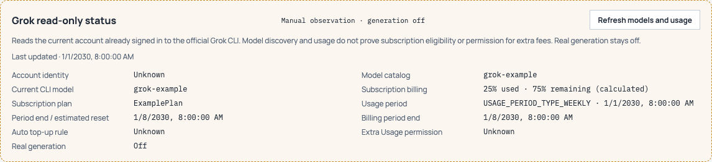

# Grok manual catalog / usage observation (#26)

Production now has a manual **Refresh models and usage** action on the Providers page. It reads the account already authenticated in the official CLI, then shows only model IDs, current CLI model, subscription tier, usage percentage, and period timestamps. It neither establishes account identity nor changes subscription eligibility, connection evidence, Extra Usage permission, or generation admission. Real generation remains off. This task runs no live account queries or model requests; the parent schedules scoped app validation separately. Keep #26 open for human acceptance.

## Observed CLI contract

The parent supplied a successful bounded probe of installed Grok `1.0.44` (`5b807183dd79`). This is an observed compatibility contract, not a complete official schema or proof of source provenance. The earlier claim that this installed version lacks the read methods is superseded by that probe.

A single owned process runs `grok agent --no-leader stdio` in a temporary working directory. It receives only these sequential JSON-RPC methods, awaiting the matching ID each time:

```text
initialize(protocolVersion: 1, clientCapabilities: {}, clientInfo: readonly-account-query / 1)
authenticate(methodId: cached_token)
_x.ai/models/list({})
_x.ai/billing({})
```

There is no session creation, prompt, retry, OAuth client, recharge operation, or generic method / shell / argument input. Only the official helper reads its cached authentication; the app does not open or export auth files or tokens. Production resolves `$HOME/.local/bin/grok`, then `grok` on PATH, with fixed arguments and a cleared environment allowing HOME/PATH/TMPDIR/LANG. The older arbitrary helper override is not used by this path. Isolated builds require the explicitly pinned fixture helper and isolated HOME.

The process deadline is 75 seconds. Success, error, timeout, and cancellation close its streams, send termination only to that owned child, wait up to two seconds, then kill/wait if needed (the final wait is bounded to ten seconds; total process budget stays below 90 seconds). The UI cancels on navigation and discards late results. Cancellation IDs are retained for 90 seconds (at most 128 entries), checked before resolution/registration and before child dispatch. Cache overflow temporarily refuses reads until the retention window ends, so eviction cannot revive a cancelled request; delayed resolution also counts against the 90-second total budget. The public-path offline regression pauses resolution, acknowledges cancellation, resumes refresh, and asserts no child or RPC, including cancellation before refresh enters. A dropped Rust future uses `kill_on_drop`. No helper stderr or raw account payload is logged, persisted, or returned. JSON-RPC responses have a 256 KiB line and 256-notification bound. Only numeric error codes and stable error categories are shown; potentially private message/data fields are discarded.

## Display semantics

- Models: JSON-RPC result's `result.currentModelId` and `result.availableModels[].modelId`. Discovery does not become a free whitelist or subscription qualification.
- Usage: `config.creditUsagePercent` must be finite and within 0–100. Remaining percentage is explicitly calculated as `100 - used`. Missing, null, wrong schema and out-of-range values remain distinct Unknown states; valid zero is retained.
- Plan: response-level snake-case `subscription_tier`.
- Usage period: `config.currentPeriod.type/start/end`; valid RFC3339 timestamps display in local time. `end` is labelled **Period end / estimated reset**, because the observed response has no independent reset field. Conflicting valid `billingPeriodEnd` makes the estimated reset Unknown and shows a conflict. No currency or money-unit scaling is inferred.
- Refresh errors clear previous values. Successful observations expire after five minutes and show their last update time. Values are memory-only and disappear on navigation/restart. Auth identity, top-up rule and Extra Usage permission stay Unknown.

The legacy `grok_readonly_status` command remains a static source-provenance/generation-gate snapshot for compatibility. It is not the result or availability of the new manual query. Source provenance is still unverified; production generation remains denied independently.

## Offline validation and handoff

Run the CONTRIBUTING gates (`pnpm build`, `pnpm test`, `pnpm release:check`, `cargo test --locked --offline --manifest-path src-tauri/Cargo.toml --lib`). Use `TAURI_DEV_HOST=127.0.0.1` if localhost resolution is unavailable. Existing Rust tests require local loopback listeners; this is separate from external account access.

`node scripts/check-grok-readonly-ui.mjs` starts its own loopback preview server and blocks external browser requests. Its bridge uses only synthetic 25% / ExamplePlan / 2030 fixtures and verifies no automatic read, one manual read, success, sparse/null, 401, cancellation/late result, expiry, and generation Off. Screenshots and a source/file hash report are written under ignored `artifacts/grok-readonly-ui`. Rust fixtures additionally cover invalid schema, network failure, timeout and owned-child cleanup. No real account payload belongs in fixtures or screenshots.

Before app validation, bind the source commit SHA, executable SHA-256 and frontend file hashes in a local artifact manifest. Parent reviewer owns independent review and any scoped actual app validation. A Draft PR is stacked on PR49 at `93e8e61efda2a1beccc14a8f22b0ebd84583ab61` while PR49 is open; after it merges, update normally without rewriting shared history.

Historical source mapping: registry `@xai-official/grok@1.0.44` had `gitHead` `5b807183dd7978a460f309132cf0d1183d743526`; the installed version prefix matches it. Public `xai-org/grok-build` snapshot `2bdd1d6a6369de0e8c68132ea4539e9abd9e14a8` declares 1.0.45 and does not prove the source behind the installed 1.0.44 bytes. That provenance limitation restricts generation; it does not negate the supplied successful read-method observation.



## Narrow reuse decision (P2 follow-up)

Keep the current official-CLI thin adapter. It already delegates cached authentication, token lifecycle, account HTTP requests and client headers to the installed official helper. The local responsibilities are manual UI triggering, owned-child cancellation/deadlines, JSON-RPC response matching, and a minimal Unknown-preserving DTO projection. These are host integration boundaries, not another authentication or provider runtime.

The pinned [CLIProxyAPI xAI authentication implementation](https://github.com/router-for-me/CLIProxyAPI/blob/e2bff0107bb307337aaa19018ccddd55f64253d5/internal/auth/xai/xai.go) already supplies discovery, device flow, polling and token refresh. Its [request executor](https://github.com/router-for-me/CLIProxyAPI/blob/e2bff0107bb307337aaa19018ccddd55f64253d5/internal/runtime/executor/xai_executor_request.go) selects CLI proxy versus official API transports. Reimplementing those behaviors in Jev is unnecessary; if later requirements need a multi-provider execution service, evaluate connecting to that existing runtime rather than porting its authentication/inference internals into Rust.

[CPA-Manager-Plus quota requests](https://github.com/seakee/CPA-Manager-Plus/blob/05ebb7f275dbe575211cb886436d4b99936c1cd9/apps/web/src/utils/quota/providerRequests.ts) are management-side billing/identity-fallback orchestration built around an auth index and API-call service. Its pinned [constants](https://github.com/seakee/CPA-Manager-Plus/blob/05ebb7f275dbe575211cb886436d4b99936c1cd9/apps/web/src/utils/quota/constants.ts) advertise Grok 0.2.101 headers. Copying this path into PR50 would add token/header/HTTP ownership and fallback reads absent from the present approved scope, without removing the host cancellation/display boundaries. This inspection read source only; it installed or ran no new software and made no account requests.

Minimum next scope: complete this P2 fix and independent review; retain CLI ownership of authentication/refresh/billing; keep generation disabled. Avoid new Jev OAuth/credential stores, direct billing HTTP, identity fallback, generic ACP/provider frameworks, and protocol translation. No runtime migration or deletion of unrelated legacy code is implemented here.
